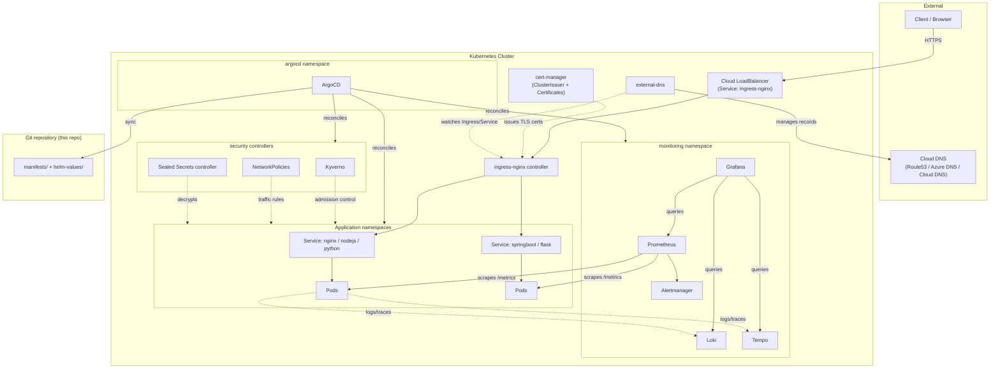
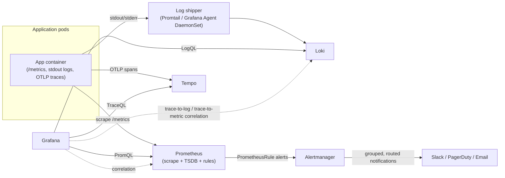
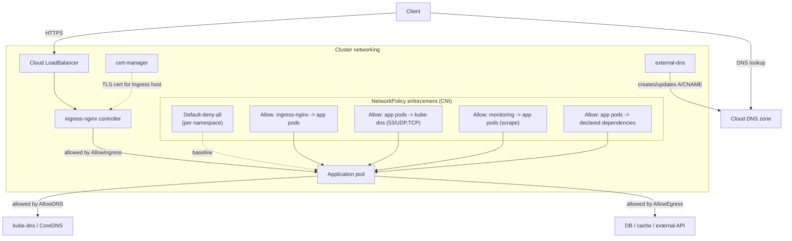

# Architecture diagrams

This folder is the intended home for visual diagram assets — `production-cluster.drawio`/`.png`, `monitoring.png`, `networking.png`. Those are binary/editable diagram files and aren't something that can be authored as part of this pass; generate them with draw.io (or export from the Mermaid sources below) and drop them here as follow-up work.

In the meantime, the same three diagrams are provided inline as Mermaid, which renders directly on GitHub and stays diffable in Git.

## Overall production cluster architecture

## Monitoring data flow

## Networking

## Regenerating the binary assets

Once `production-cluster.drawio`, `monitoring.png`, and `networking.png` are produced (e.g. via draw.io, Mermaid CLI, or Excalidraw), place them in this folder alongside this README and link them in from `docs/architecture.md` and `docs/monitoring.md` as the canonical diagrams. Keep the Mermaid sources above in sync with any changes so the text-diffable version doesn't drift from the images.
